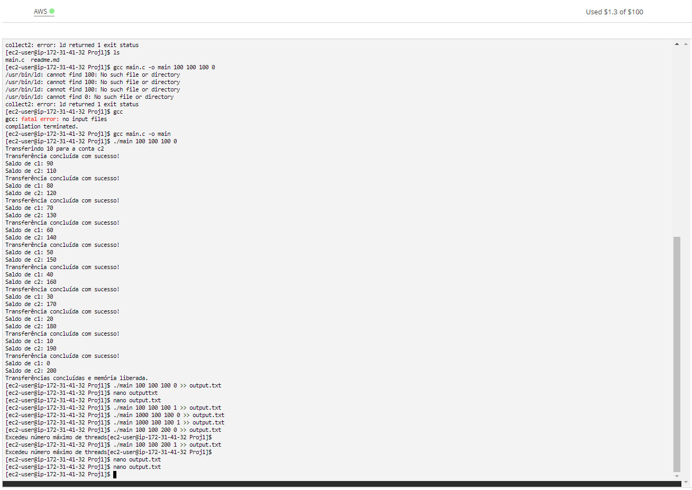

## Documentação do trabalho

- **Para a resolução do problema foi utilizado:**
  - `p_threads.h` **: para execução de forma concorrente**
  - `semaphore.h` **: para corrigir problema de condição de corrida**

- **O editor de texto utilizado foi o `nano`.**

- **Foi colocado o código proposto em um arquivo chamado `main.c`.**

- **Na execução do arquivo, é possível colocar quatro parâmetros adicionais:**
  1. `from.saldo` **: define o valor `(int)` do `saldo` da  conta `from`. *Default: 100***
  2.  `to.saldo` **: define o valor `(int)` do `saldo` da conta `to`. *Default: 100***
  3.  `n_thread` **: define o valor `(int)` de threads criados até um máx = 100. *Default: 100***
  4.  `troca` **: define se vai trocar as contas `0 = não : 1 = sim`. *Default = 0*** 

- **O arquivo 'main.c' pode ser executados da seguinta forma:** 
	- `gcc main.c - o <nome_desejado>`
	- `./<nome_desejado> <from.saldo> <to.saldo> <n_thread> <troca>`
- **As saídas da execução da aplicação foram colocadas: no arquivo `output.txt`**

- **Foram colocadas screenshots da execução no ambiente aws dos códigos nos seguintes arquivos:**
	-`console.png`

## Imagens da AWS 

## Integrantes do grupo:
- ***Nome: André Franco Raineri TIA: 32163681***
- ***Nome: Gabriel Gonzaga Chung TIA: 32263651***

