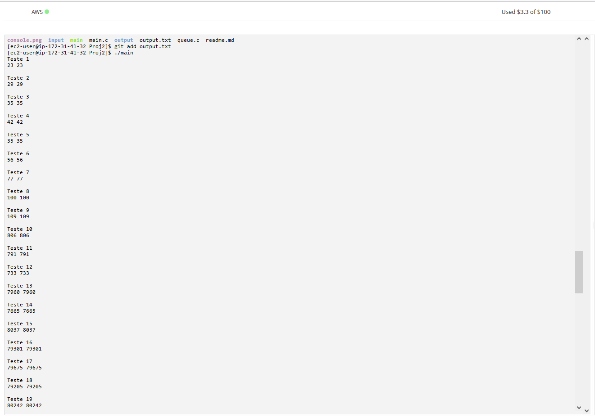

## Documentação do trabalho

- **O editor de texto utilizado foi o `nano`.**

- **Foi colocado o código proposto em um arquivo chamado `main.c`.**

- **Foi colocado o código que representa a estrutura de dados 'fila' em `queue.c`**.

- **Foi colocado as entradas propostas do problema na pasta `input`** 

- **Foi colocado as saídas esperadas do problema na pasta `output`**

- **Para a resolução do problema foi utilizado:**
  - `queue.h` **: para a simulação das filas.**

- **O arquivo 'main.c' pode ser executados da seguinta forma:** 
	- `gcc main.c - o <nome_desejado>`

- **Ao invés de pedir entrada do usuário, o código foi ajustado para receber como entrada quaisquer arquivos, sob a seguinte especificação:** 
  - **o arquivo deve estar dentro da pasta `input` e  seu nome deve ser `E_<n>`  sendo `n` o valor `58` que se trata do ultimo arquivo de entrada proposto.**

- **Foi colocado um exemplo de execução em `console2.png.`**

- **A saída do programa funciona da seguinte forma:**
  
  - `Teste <n_iteração>`
  - `<valor_obtido> <valor_esperado>`
  - `... // Próximas iterações`
- **As saídas da execução da aplicação foram colocadas: no arquivo `output.txt`.**

- **Foram  obtidos os resultados esperados para todas as execuções.**

- **Foram colocadas screenshots da execução no ambiente aws dos códigos nos seguintes arquivos:**
	- `console.png`
	- `console2.png`

## Imagens da AWS 

## Integrantes do grupo:
- ***Nome: André Franco Raineri TIA: 32163681***
- ***Nome: Gabriel Gonzaga Chung TIA: 32263651***

